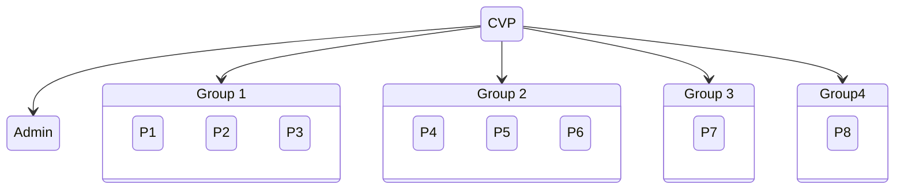

# Base Procedure 1

Example State Diagram

```mermaid
stateDiagram

state "CVP" as CVP
state "Admin" as BusinessAdmin
state "Group 1" as Group1
state "<center>P1</center>" as ISV
state "<center>P2</center>" as Services
state "<center>P3</center>" as Channels
state "Group 2" as Group2
state "<center>P4</center>" as GTM
state "<center>P5</center>" as Tech
state "<center>P6" as PartnerRecruitGrowth
state "Group 3" as Group3
state "<center>P7</center>" as PartnerSalesOffice
state "Group4" as Group4
state "<center>P8</center>" as ChiefOfStaff
state Group1 {
  ISV
  Services
  Channels
}
state Group2 {
  GTM
  Tech
  PartnerRecruitGrowth
}
state Group3 {
  PartnerSalesOffice
}
state Group4 {
  ChiefOfStaff
}
CVP --> BusinessAdmin
CVP --> Group1
CVP --> Group2
CVP --> Group3
CVP --> Group4
```
